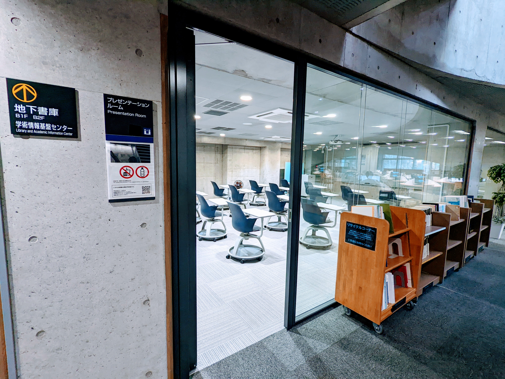
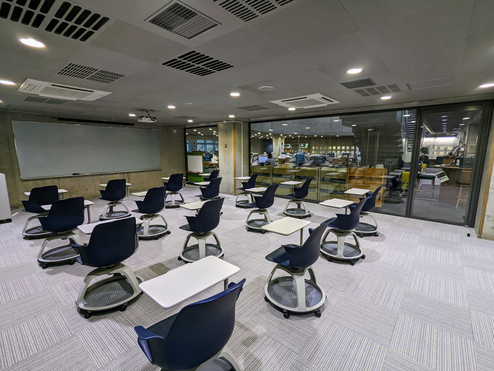
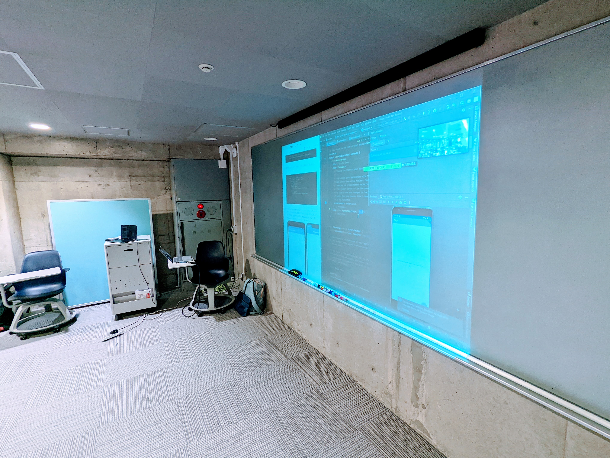
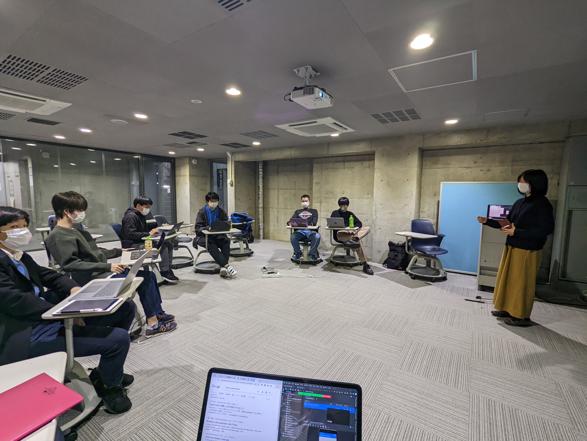

# Google Developer Student Club TMU > event > #1 Flutter  
## date&time: 2022/12/17 13:00-17:00  
## at: 東京都立大学 南大沢キャンパス 図書館本館 & オンライン  
勉強会第1回用のリポジトリです.  
## schedule:   
- LT会#1  
- Flutter勉強会  
## LT会#1  
### speakers (発表順)  
- @bbtit
- @Rei-Suzuki1729
  
## Flutter勉強会  
1. Flutter環境構築  
2. Dartの基本構文  
3. Flutterレイアウト  
4. Flutterインタラクティブ  

### Dory
https://dory.app/events/xgkCuHnLKGoUU78cOK2T/5d2dc011_gdsc-tmu-event-1-flutter/

### 持ち物 (対面の方向け)
- PC (Windows or macOS 推奨, 最大10GB程度の空きが必要です)
- PC充電器
- (もしお持ちの方がいればご協力お願いします) 延長コード
- 飲み物は蓋付きのもののみ持ち込めます
  
### その他連絡事項
- 途中参加, 途中退室は自由です.
- 今回の勉強会のメインランゲージは日本語です.
- WEB系の開発と比べて, モバイルアプリ開発ではandroidエミュレータの起動やコンパイルに高い処理能力が要求されるため, PCのスペックによっては時間がかかったり, 実行できなかったりする可能性があることをあらかじめご了承ください.
- 当日の参加人数によっては, 都立大のWiFiはキャパシティを超える可能性があります. 容量無制限のポケットWiFiやテザリング端末をお持ちの方は, お持ちいただけば安心かと思います.

## credit  
organized by GDSC TMU event-core  
### facilitator:  
Tomohiro Tani @taniiicom,  
Aoi Ohta @aoiohta,  
GDSC TMU technical-core,  
GDSC TMU outreach-core  
 
## ps. minutes
### participants
15 people (on-site: 8, online: 7)
### photos

### links
https://twitter.com/GdscTmu/status/1604436148603932673
https://twitter.com/marshma84093472/status/1604437702220206080
https://twitter.com/taniiicom/status/1604049021898985472
https://twitter.com/taniiicom/status/1603322216124678145
https://gdsc.community.dev/events/details/developer-student-clubs-tokyo-metropolitan-university-presents-event-1-flutter/

*Thank you for participating!*
